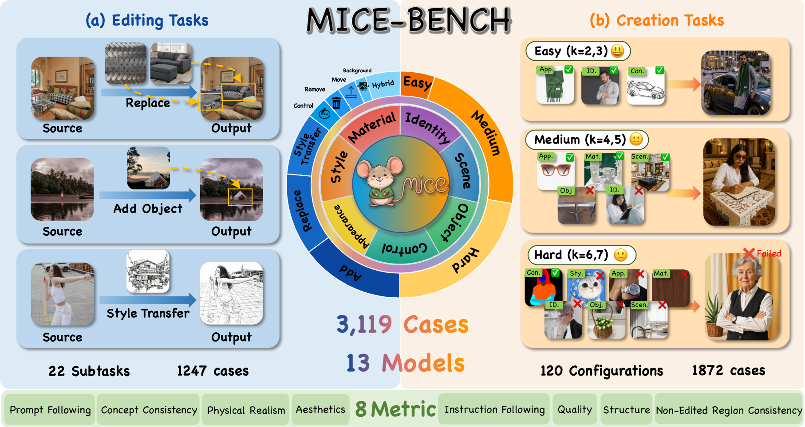
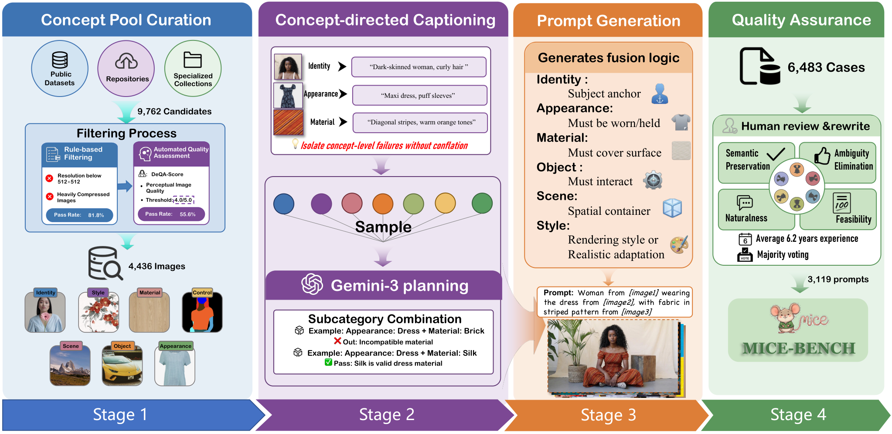

# MICE-Bench

### A Challenging and Comprehensive Benchmark for Multi-Reference Image Creation and Editing

[Project page](https://mice-bench.github.io/MICE-Bench/) · [Paper](docs/paper.pdf) · [Dataset](https://huggingface.co/datasets/MICE-Bench/MICE-Bench)

<p align="center">
  
</p>

MICE-Bench evaluates whether image generation systems can faithfully combine heterogeneous concepts from multiple references. It contains two complementary tracks—image creation and image editing—and covers seven concept dimensions: **Identity, Object, Style, Scene, Material, Control, and Appearance**.

The benchmark described in the paper contains **3,119 cases**: 1,872 creation cases from 120 concept combinations and 1,247 editing cases across 22 atomic subtasks. Constraint density ranges from two to seven concepts.

## News

- **2026-07:** Initial code and project-page release.
- Dataset and leaderboard links will become active with the Hugging Face release.

## Benchmark at a glance

| Track | Cases | Inputs | Coverage |
|---|---:|---|---|
| Creation | 1,872 | 2–7 reference images + prompt | 120 combinations over 7 concepts |
| Editing | 1,247 | target + 1–4 references + instruction | 22 subtasks; local and global editing |

The evaluation protocol has eight dimensions: prompt/instruction following, concept consistency, physical realism, image aesthetics, image quality, image structure, and—on editing tasks—non-edited-region consistency.

## Data construction

MICE-Bench uses a four-stage pipeline: concept-pool curation, concept-directed captioning, concept-aware prompt planning, and expert quality assurance.



## Installation

```bash
git clone https://github.com/MICE-Bench/MICE-Bench.git
cd MICE-Bench
python -m venv .venv
# Linux/macOS: source .venv/bin/activate
# Windows: .venv\Scripts\activate
pip install -r requirements.txt
```

Creation Q3 uses the UniPercept source included in [`unipercept/`](unipercept). It runs locally and does not call an external scoring API. UniPercept has a separate GPU environment and checkpoint setup described below.

### Deploy UniPercept for creation Q3

UniPercept is recommended on Linux with an NVIDIA CUDA GPU. Create a separate Python 3.10 environment so its pinned PyTorch/Transformers versions do not conflict with other model environments:

```bash
conda create -n mice-unipercept python=3.10 -y
conda activate mice-unipercept
cd MICE-Bench
pip install -r unipercept/requirements-mice.txt
```

This smaller requirements file contains only the Q3 inference dependencies. The upstream [`unipercept/requirements.txt`](unipercept/requirements.txt) additionally includes training and benchmark packages and is not required for MICE-Bench evaluation. If the pinned PyTorch wheel does not match your CUDA installation, install the appropriate PyTorch 2.8 build first and then install the remaining packages.

`flash-attn>=2.8.3` is optional and speeds up inference, but it requires a compatible CUDA toolkit and compiler. Install it separately when supported; otherwise run Q3 with `--no-flash-attn`.

Download the official checkpoint into the default location:

```bash
huggingface-cli download Thunderbolt215215/UniPercept \
  --local-dir unipercept/ckpt/UniPercept
```

The resulting directory must contain the Hugging Face model configuration, tokenizer, and weight files. First run the included smoke test (it uses `docs/assets/MICE-teaser.png` by default):

```bash
python unipercept/test_mice.py
# Add --no-flash-attn if FlashAttention is unavailable.
```

Then test Q3 on model-output metadata with:

```bash
conda activate mice-unipercept
python evaluation/creation/Q3_evaluate.py \
  --input outputs/my_model/create.json \
  --dataset-root data/create
```

Q3 directly imports `unipercept/src/internvl`, loads the checkpoint once, and scores every output on three 0–100 dimensions: image aesthetics (`iaa`), image quality (`iqa`), and image structure/texture (`ista`). Results are saved per generated model and support automatic resume.

## Download the dataset

Images and metadata are hosted on Hugging Face rather than GitHub:

```bash
python scripts/download_data.py
python scripts/validate_dataset.py
```

Expected layout:

```text
data/
├── create.json
├── edit.json
├── create/                 # creation reference images
│   ├── 2/
│   └── ...
└── edit/                   # editing target/reference images
    ├── 2/
    └── ...
```

Each metadata record provides a stable `case_id`, source paths, English prompt, concept-specific verification questions, and an initially empty `result` mapping. See [DATASET.md](DATASET.md) for the complete schema.

## Evaluate your model

Save each generated image as `<case_id>.png`, then attach the outputs to a copy of the metadata:

```bash
python scripts/prepare_submission.py \
  --metadata data/create.json \
  --images outputs/my_model/create \
  --model-name my_model \
  --output outputs/my_model/create.json
```

API-based metrics use an OpenAI-compatible vision endpoint:

```bash
export OPENAI_API_KEY=your_key
export OPENAI_BASE_URL=https://api.openai.com/v1
```

Run creation evaluation (omit UniPercept with `--skip-q3`):

```bash
python evaluation/creation/run_all_evaluations.py \
  --input outputs/my_model/create.json
```

The default checkpoint is `unipercept/ckpt/UniPercept`. Use `--unipercept-model-path /another/checkpoint` to override it, `--no-flash-attn` when FlashAttention is unavailable, or `--skip-q3` to run only the API-based metrics in another environment.

Run editing evaluation:

```bash
python scripts/prepare_submission.py \
  --metadata data/edit.json \
  --images outputs/my_model/edit \
  --model-name my_model \
  --output outputs/my_model/edit.json
python evaluation/editing/run_all_evaluations.py --input outputs/my_model/edit.json
```

Both runners are resumable, expose `--workers`, `--vlm-model`, and `--base-url`, and support `--skip-q1` through `--skip-q4`. Use `--dry-run` to inspect all commands. Metric details and aggregation commands are in [evaluation/README.md](evaluation/README.md).

## Repository structure

```text
MICE-Bench/
├── docs/                   # GitHub Pages site, paper, and figures
├── evaluation/
│   ├── creation/           # PF, CC, IA/IQ/IS, PR
│   └── editing/            # IF, CC, NERC, PR
├── scripts/                # download, validation, submission helpers
├── DATASET.md
├── CITATION.cff
└── LICENSE
```


## Citation

```bibtex
@inproceedings{luo2026micebench,
  title     = {MICE-Bench: A Challenging and Comprehensive Benchmark for Multi-Reference Image Creation and Editing},
  author    = {Luo, Siqi and Zheng, Huayu and Shen, Jianghan and Xin, Yi and Xu, Luxin and Liu, Jiyao and Zhang, Xinyu and Zhou, Hang and Xie, Pengyu and Li, Xiaohui and Cao, Shuo and Pu, Yuandong and He, Junjun and Fu, Bin and Liu, Yihao and Qiao, Yu and Zhai, Guangtao and Cao, Yuewen and Liu, Xiaohong},
  booktitle = {International Conference on Machine Learning},
  year      = {2026}
}
```

## License and data terms

The evaluation code is released under the [MIT License](LICENSE). Dataset images retain their original licenses; consult the Hugging Face dataset card and per-item provenance before redistribution. MICE-Bench is intended for research and evaluation. Generated outputs remain subject to the terms of the evaluated model.
